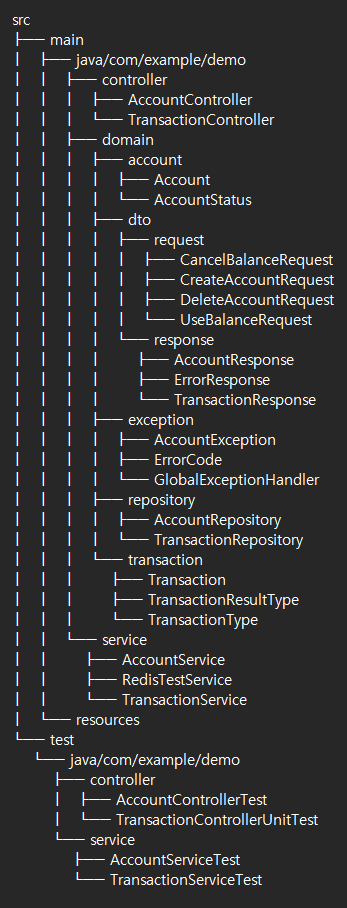

# ZB Account Project

## 1. 프로젝트 개요
계좌 생성/해지/확인 API와 거래 생성/취소/확인 API를 제공하는 시스템입니다. 
Redis를 활용한 동시성 제어와 트랜잭션 관리가 구현되어 있습니다.

---

## 2. 개발 환경
- Java 17  
- Spring Boot 3.4.0  
- Spring Data JPA  
- H2 Database  
- Redis (Redisson)  
- JUnit 5  
- Mockito  
- Gradle 8.11.1

---

## 3. 프로젝트 구조


---

## 4. 주요 기능

### 4.1 계좌 관리 API
1. **계좌 생성 (POST /api/v1/accounts)**
   - 사용자당 최대 10개 계좌 제한
   - 10자리 랜덤 계좌번호 생성
   - 초기 잔액 설정

2. **계좌 해지 (DELETE /api/v1/accounts)**
   - 잔액이 있는 계좌는 해지 불가
   - 이미 해지된 계좌는 재해지 불가
   - 사용자 검증

3. **계좌 조회 (GET /api/v1/accounts/{userId})**
   - 사용자의 전체 계좌 목록 조회

### 4.2 거래 관리 API
1. **잔액 사용 (POST /api/v1/transactions/use)**
   - Redis를 통한 동시성 제어
   - 잔액 부족 검증
   - 거래 기록 생성

2. **거래 취소 (POST /api/v1/transactions/cancel)**
   - 원거래 금액과 취소 금액 일치 검증
   - 거래 계좌 일치 검증
   - 취소 거래 기록 생성

3. **거래 조회 (GET /api/v1/transactions/{transactionId})**
   - 거래 상세 내역 조회
   - 성공/실패 거래 모두 조회 가능

---

## 5. 핵심 구현 사항

### 5.1 동시성 제어
```java
@Service
public class RedisTestService {
    private final RedissonClient redissonClient;
    
    public void lock(String accountNumber) {
        RLock lock = redissonClient.getLock(getLockKey(accountNumber));
        boolean isLock = lock.tryLock(1, 15, TimeUnit.SECONDS);
    }
}
```

### 5.2 예외 처리
```java
@RestControllerAdvice
public class GlobalExceptionHandler {
    @ExceptionHandler(AccountException.class)
    public ResponseEntity<ErrorResponse> handleAccountException(AccountException e) {
        return ResponseEntity.status(HttpStatus.BAD_REQUEST)
                             .body(new ErrorResponse(e.getErrorCode(), e.getErrorMessage()));
    }
}
```

---

## 6. 테스트

1. **컨트롤러 테스트**
   - AccountControllerTest
   - TransactionControllerUnitTest

2. **서비스 테스트**
   - AccountServiceTest
   - TransactionServiceTest

3. **주요 테스트 케이스**
   - 계좌 생성 성공/실패
   - 잔액 사용 성공/실패
   - 거래 취소 성공/실패
   - 동시성 제어 검증

---

## 7. 실행 방법
```bash
# 프로젝트 빌드
./gradlew build

# 테스트 실행
./gradlew test

# 애플리케이션 실행
./gradlew bootRun
```

---

## 8. API 문서
Swagger UI: [http://localhost:8080/swagger-ui.html](http://localhost:8080/swagger-ui.html)